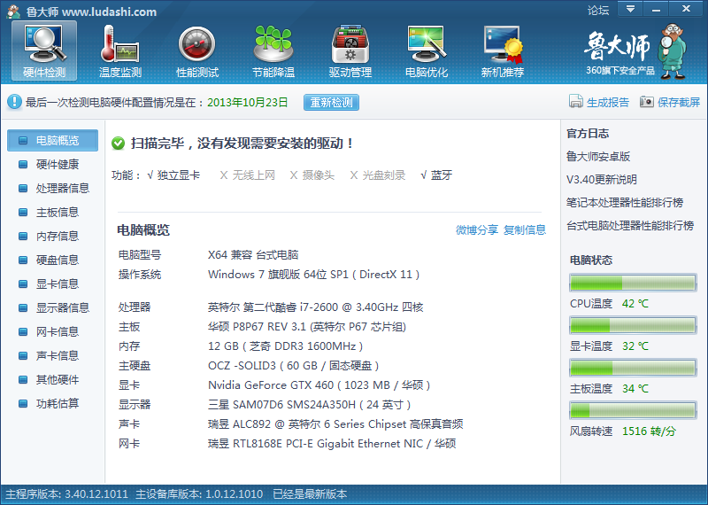

说明
===

####1. 主板是P8P67 Rev3.1, BIOS版本2302，显卡GTX460。这块主板的BIOS不能升级到3xxx, 否则会没有声音。

####2. Clover的版本2795,支持启动10.9,10.10
####3. drivers64UEFI目录下有以下文件  
    FSInject-64.efi
	VBoxHfs-64.efi或HFSPlus-64.efi
	OsxAptioFixDrv-64.efi
	OsxFatBinaryDrv-64.efi
	
	NTFS.efi
	DataHubDxe-64.efi
	EmuVariableUefi-64.efi
	PartitionDxe-64.efi
	
####4. 安装的时候选用install目录下的文件，安装完后替换正式的文件。
####5. DSDT已经被Patched，假冒声卡的layout-id是1。
插入的代码如下所示, 这次修改是依据链接[How to add HDEF to your dsdt](http://www.tonymacx86.com/audio/50697-easyguide-how-add-hdef-your-dsdt.html)。

            Device (HDEF)
            {
                Name (_ADR, 0x001B0000)
                Method (_PRW, 0, NotSerialized)
                {
                    Return (Package (0x02)
                    {
                        0x0D, 
                        0x05
                    })
                }

                Method (_DSM, 4, NotSerialized)
                {
                    Store (Package (0x04)
                        {
                            "layout-id", 
                            Buffer (0x04)
                            {
                                0x01, 0x00, 0x00, 0x00
                            }, 

                            "PinConfigurations", 
                            Buffer (Zero) {}
                        }, Local0)
                    DTGP (Arg0, Arg1, Arg2, Arg3, RefOf (Local0))
                    Return (Local0)
                }
            }

####6. Clover启动Win7,Win8
windows的引导放置有两种方式：可以放到efi分区也可以放置到系统的根目录下。

- 如果你只装了一个win系统可以把Microsoft文件夹复制到efi分区/EFI/下
- win7系统：将备份的win7系统的/EFI/文件夹复制到win7系统的根目录下，将里面的boot文件夹删除，只保留Microsoft文件夹
- win8系统：和win7系统类似。可参考文章[《纯uefi+gpt+clover统一引导win7+win8.1+OSX109+ubuntu12.04LTS单盘四系》](http://bbs.pcbeta.com/viewthread-1459599-1-1.html)

===
参考： 

* [http://www.tonymacx86.com](http://www.tonymacx86.com)
* [http://www.osx86.net](http://www.osx86.net)
* [http://www.insanelymac.com](http://www.insanelymac.com)
* [http://bbs.pcbeta.com](http://bbs.pcbeta.com)